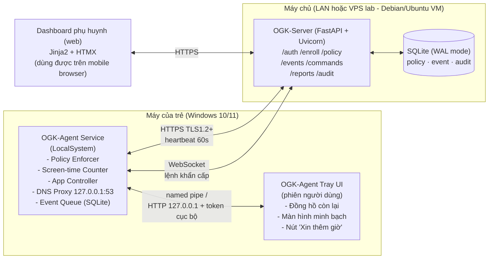
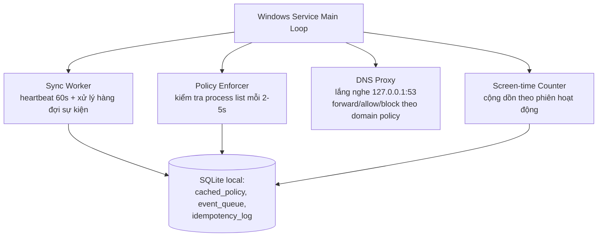
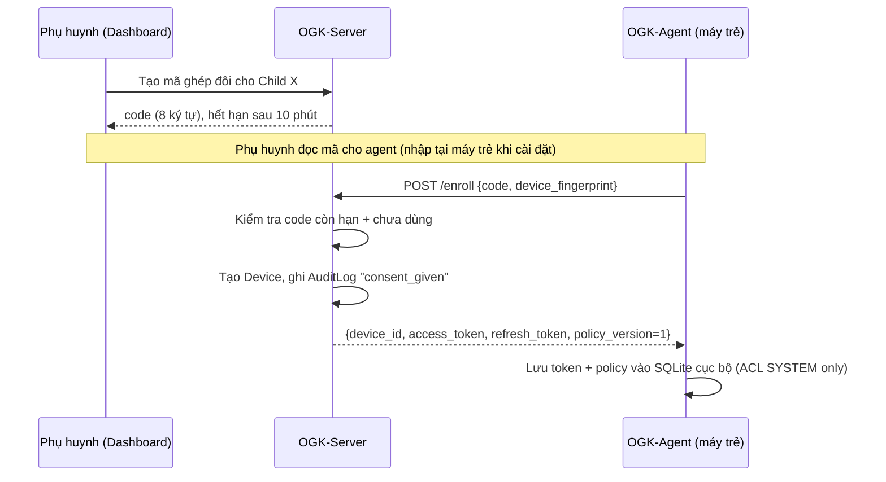

# ChildGuard (OGK) — Thiết kế Kiến trúc Hệ thống

> Phiên bản: 0.1 (draft thiết kế trước khi code)
> Phạm vi: Agent Windows 10/11, OGK-Server (FastAPI), Dashboard phụ huynh, giao thức đồng bộ.

---

## 1. Tổng quan

ChildGuard (tên nội bộ: **OGK** — *Online Guardian Kit*) là hệ thống giám sát và kiểm soát hoạt động máy tính dành cho trẻ nhỏ, theo mô hình client–server phân tán:

- **OGK-Agent**: cài trên máy Windows của trẻ, gồm một Windows Service (chạy dưới quyền `LocalSystem`) thực thi chính sách, và một Tray UI (chạy trong phiên người dùng) hiển thị minh bạch cho trẻ.
- **OGK-Server**: máy chủ điều phối (FastAPI), quản lý thiết bị, chính sách, sự kiện, nhật ký kiểm toán.
- **Dashboard phụ huynh**: giao diện web để phụ huynh cấu hình chính sách, duyệt yêu cầu, xem báo cáo.

Nguyên tắc thiết kế xuyên suốt:

1. **Minh bạch với trẻ** — trẻ luôn biết mình đang bị giám sát (không phải spyware ẩn), có thể xem lý do bị chặn và gửi yêu cầu.
2. **Đồng ý của cha mẹ được ghi nhận** — bước ghép đôi (enrollment) là bằng chứng đồng ý, lưu trong audit log, tham chiếu Nghị định 13/2023/NĐ-CP về bảo vệ dữ liệu cá nhân.
3. **An toàn khi mất mạng** — agent phải tiếp tục hoạt động đúng chức năng cốt lõi (đếm giờ, chặn ứng dụng) ngay cả khi server không phản hồi.
4. **Chống bypass đơn giản** — một đứa trẻ có kiến thức cơ bản (rút mạng, tắt Wi-Fi, đổi giờ hệ thống) không được phép vô hiệu hóa chính sách chỉ bằng thao tác đó.

---

## 2. Kiến trúc tổng thể



**Vì sao chọn Jinja2 + HTMX thay vì React cho Dashboard?** Đồ án cần "cài đặt được trong 15 phút trên máy sạch". Jinja2+HTMX render phía server, không cần bước `npm build`/bundler, không cần Node.js trên VM server — giảm một tầng phụ thuộc, dễ demo, và HTMX vẫn cho trải nghiệm tương tác (partial update) đủ tốt cho các form cấu hình + bảng báo cáo. Đây là quyết định **tối ưu cho việc bàn giao/chấm điểm**, không phải giới hạn kỹ thuật — nếu sau này cần UI phức tạp hơn (biểu đồ tương tác nhiều lớp), có thể thay bằng React mà không đổi API.

---

## 3. Thành phần hệ thống

| Thành phần | Trách nhiệm chính | Công nghệ / Ghi chú kỹ thuật |
|---|---|---|
| **OGK-Agent — Service** | Áp chính sách, đếm thời gian sử dụng, chặn tiến trình/ứng dụng, lọc DNS, đệm sự kiện khi mất mạng | Python 3.11+, `pywin32` (`win32serviceutil.ServiceFramework`), `psutil` để liệt kê/kill tiến trình; đăng ký Service Recovery Options (SCM) để tự khởi động lại sau crash |
| **OGK-Agent — Tray UI** | Giao diện cho trẻ: đồng hồ đếm ngược, lý do bị chặn, nút xin thêm giờ | Chạy trong phiên đăng nhập user (không phải SYSTEM); giao tiếp Service qua **named pipe** (ưu tiên) hoặc HTTP `127.0.0.1:<port>` kèm token cục bộ ngẫu nhiên sinh mỗi lần Service khởi động |
| **OGK-Server** | Xác thực phụ huynh, quản lý thiết bị/trẻ, phát hành policy, nhận sự kiện, tổng hợp báo cáo, audit log | FastAPI + Uvicorn (ASGI), SQLAlchemy ORM, SQLite chế độ WAL, TLS đầu cuối, rate-limit theo IP/device_id |
| **Dashboard phụ huynh** | Cấu hình quota/lịch tuần/whitelist-blacklist, duyệt yêu cầu "xin thêm giờ", xem báo cáo | Jinja2 + HTMX, responsive (dùng được trên trình duyệt điện thoại) |
| **Kho dữ liệu cục bộ (Agent)** | Bản sao chính sách gần nhất + hàng đợi sự kiện chưa gửi | SQLite tại `%ProgramData%\ChildGuard\agent.db`, ACL chỉ `SYSTEM` và `Administrators` được ghi (dùng `icacls` khi cài đặt) |

### 3.1. Sơ đồ tiến trình nội bộ Agent



---

## 4. Mô hình dữ liệu (OGK-Server)

Bảng chính (SQLAlchemy models), tên bảng số ít viết hoa cho ORM class, tên cột `snake_case`:

| Bảng | Cột chính | Ghi chú |
|---|---|---|
| `Parent` | `id`, `email`, `password_hash`, `created_at` | Tài khoản phụ huynh |
| `Child` | `id`, `parent_id`, `display_name`, `birth_year (tuỳ chọn)` | Một phụ huynh có thể quản nhiều trẻ |
| `Device` | `id (device_id, UUID)`, `child_id`, `fingerprint_hash`, `enrolled_at`, `last_seen_at`, `status (active/revoked)` | Sinh ra khi enrollment thành công |
| `EnrollmentCode` | `code (8 ký tự)`, `parent_id`, `child_id`, `expires_at`, `used_at` | TTL 10 phút, một lần dùng |
| `Token` | `id`, `device_id`, `access_token_hash`, `refresh_token_hash`, `access_expires_at`, `refresh_expires_at`, `revoked` | Access token ngắn hạn (vd 15 phút), refresh dài hạn (vd 30 ngày) |
| `Policy` | `id`, `child_id`, `version (int, tăng dần)`, `quota_json`, `schedule_json`, `app_rules_json`, `domain_rules_json`, `created_at` | Mỗi lần sửa chính sách tạo **bản ghi mới** tăng `version`, không sửa đè — phục vụ audit và rollback |
| `Event` | `id`, `device_id`, `event_type`, `payload_json`, `occurred_at`, `received_at`, `idempotency_key (unique)` | `idempotency_key` chống đếm trùng khi agent gửi lại theo lô |
| `Command` | `id`, `device_id`, `command_type (lock/unlock/grant_minutes)`, `payload_json`, `created_at`, `delivered_at`, `acked_at` | Hàng đợi lệnh khẩn, ưu tiên đẩy qua WebSocket, fallback vào response heartbeat nếu WS rớt |
| `AuditLog` | `id`, `actor_type (parent/agent/system)`, `actor_id`, `action`, `detail_json`, `created_at` | Ghi mọi hành động nhạy cảm: enrollment, đổi policy, duyệt yêu cầu, revoke device |

**Idempotency**: `idempotency_key` = `hash(device_id + local_event_id)`, sinh **tại agent** khi sự kiện xảy ra (không phải khi gửi) — vì vậy vẫn đúng cả khi agent gửi lại nhiều lần do mất kết nối giữa chừng.

---

## 5. Giao thức & vòng đời

### 5.1. Ghép đôi (Enrollment)



- `device_fingerprint` = băm của (Machine GUID từ registry + tên máy + số hiệu ổ đĩa hệ thống) — đủ để phát hiện agent bị copy sang máy khác, **không** thu thập thông tin định danh vượt mức cần thiết (tối giản dữ liệu theo Nghị định 13/2023).
- Việc tạo `Device` + ghi `AuditLog` tại bước này **chính là điểm ghi nhận đồng ý** — cần lưu thêm `consent_text_version` (phiên bản nội dung thông báo đồng ý đã hiển thị) để tra soát sau này nếu chính sách thay đổi.

### 5.2. Nhịp tim (Heartbeat) — mỗi 60 giây

Request: `POST /heartbeat`
```json
{
  "device_id": "...",
  "policy_version": 3,
  "quota_used_seconds": 5400,
  "queued_event_count": 2
}
```
Response:
```json
{
  "policy_version": 4,
  "policy_changed": true,
  "pending_commands": [
    {"command_id": "...", "type": "grant_minutes", "payload": {"minutes": 15}}
  ]
}
```
- Nếu `policy_changed = true` → agent gọi `GET /policy?since_version=3` để lấy đầy đủ bản mới, áp dụng, rồi cập nhật `policy_version` cục bộ.
- Heartbeat **không** phải kênh chính cho lệnh khẩn (xem 5.3) vì độ trễ tối đa của heartbeat có thể lên đến gần 60s — không đạt yêu cầu <5s.

### 5.3. Lệnh khẩn qua WebSocket

- Agent duy trì kết nối `wss://.../ws/{device_id}` (tự reconnect với backoff nếu rớt, tối đa mỗi 5s thử lại).
- Server đẩy `command` ngay khi phụ huynh bấm "Khóa ngay" trên dashboard → yêu cầu độ trễ < 5 giây (đo từ lúc phụ huynh bấm nút đến lúc agent nhận frame).
- Agent phải `ACK` lại qua WebSocket hoặc qua `POST /commands/{id}/ack` — nếu server không nhận ACK trong 10s, lệnh được đẩy lại qua kênh heartbeat tiếp theo như phương án dự phòng (đảm bảo lệnh không bị mất khi WS rớt đúng lúc gửi).
- **Vì sao vẫn cần fallback qua heartbeat dù có WebSocket?** WebSocket có thể rớt do NAT timeout, đổi mạng, sleep máy — không thể coi là kênh đảm bảo 100%. Thiết kế 2 tầng (WS ưu tiên + heartbeat dự phòng) đánh đổi một chút độ phức tạp để đổi lấy độ tin cậy giao lệnh.

### 5.4. Chế độ ngoại tuyến

- Agent luôn giữ **bản sao chính sách gần nhất** trong SQLite cục bộ và tiếp tục:
  - Đếm giờ sử dụng (ghi vào `event_queue`, chưa gửi).
  - Áp app/domain rules như bình thường (không cần server để chặn).
- Khi có mạng trở lại: gửi các event theo lô (`POST /events/batch`), mỗi event kèm `idempotency_key` để server dedupe an toàn dù gửi lại nhiều lần.
- Batch có giới hạn kích thước (vd 200 event/lần) để tránh một lần đồng bộ quá nặng sau khi mất mạng lâu ngày.

### 5.5. Chính sách hết hạn khi mất kết nối dài ngày — quyết định thiết kế

**Quyết định: FAIL-CLOSED có kiểm soát (không fail-open tuyệt đối), theo 2 giai đoạn.**

| Giai đoạn | Điều kiện | Hành vi |
|---|---|---|
| **Giai đoạn 1 — Enforce cứng** | Mất kết nối server từ 0 đến N₁ ngày (đề xuất N₁ = 3) | Tiếp tục áp **nguyên vẹn** policy đã cache: đúng quota, đúng lịch, đúng app/domain rules. Tray UI hiển thị rõ "Không kết nối được máy chủ — vẫn đang dùng chính sách đã lưu từ [ngày]". |
| **Giai đoạn 2 — Chế độ an toàn suy giảm (degraded safe-mode)** | Mất kết nối > N₁ ngày, tới N₂ ngày (đề xuất N₂ = 14) | Chuyển sang **policy an toàn mặc định** cứng trong agent (không phải mở toàn bộ): chỉ cho phép danh sách ứng dụng giáo dục/hệ thống tối thiểu đã whitelist sẵn (trình duyệt, ứng dụng văn phòng, không giới hạn giờ), chặn toàn bộ domain ngoài whitelist DNS an toàn (vd danh sách domain giáo dục cơ bản). Ghi log rõ ràng "degraded_mode_entered" để audit. |
| **Sau N₂ ngày** | — | Vẫn giữ nguyên trạng thái degraded safe-mode, **không** bao giờ tự mở khóa hoàn toàn (fail-open) chỉ vì thời gian trôi qua. Gỡ bỏ hoàn toàn yêu cầu quyền Administrator tại máy (gỡ cài đặt) hoặc mã "unlock khẩn cấp" ký số cấp riêng cho phụ huynh lúc enrollment (lưu offline, không qua mạng). |

**Lý do bảo vệ lựa chọn này (không chọn fail-open):**
1. **Chống bypass tầm thường** — nếu agent fail-open sau N ngày mất mạng, một đứa trẻ chỉ cần rút cáp mạng/chặn agent gọi ra ngoài (vd sửa file hosts, chặn qua firewall) trong đúng N ngày là vô hiệu hóa toàn bộ hệ thống. Đây là lỗ hổng logic nghiêm trọng nhất có thể bị khai thác, nên thiết kế phải loại trừ nó bằng nguyên tắc.
2. **Không "brick" thiết bị vĩnh viễn** — nếu chọn fail-closed tuyệt đối (giữ nguyên policy chặt vô thời hạn), rủi ro là nếu phụ huynh ngừng dịch vụ/gỡ server mà quên gỡ agent đúng cách, máy trẻ bị khóa quá mức không có lối thoát hợp lệ. Giai đoạn 2 (degraded safe-mode) giải quyết việc này: máy vẫn dùng được ở mức tối thiểu (học tập), không bị "chết cứng", nhưng cũng không quay lại mở hoàn toàn.
3. **Cơ chế thoát an toàn thuộc về con người, không phải thời gian** — việc "mở khóa" chỉ nên xảy ra qua hành động có thẩm quyền rõ ràng (gỡ cài đặt bằng quyền Admin, hoặc mã unlock ký số phát tại thời điểm enrollment), không nên là hệ quả tự động của việc chờ đủ N ngày.

> Khi vấn đáp, nếu giám khảo hỏi "vì sao không đơn giản là fail-open sau X ngày cho nhẹ", câu trả lời cốt lõi: **fail-open biến "mất kết nối" thành một vector tấn công có thể chủ động kích hoạt (chỉ cần cắt mạng)**, vi phạm mục tiêu cốt lõi của hệ thống là kiểm soát vẫn hiệu lực ngay cả khi bị chống đối.

---

## 6. Đặc tả API (OGK-Server)

| Method & Path | Auth | Mô tả |
|---|---|---|
| `POST /auth/login` | Không (nhập email/mật khẩu) | Phụ huynh đăng nhập, trả JWT session cho dashboard |
| `POST /enroll` | Enrollment code | Ghép đôi thiết bị mới, trả `device_id` + token pair |
| `POST /auth/refresh` | Refresh token | Cấp access token mới |
| `GET /policy?since_version=` | Access token (agent) | Lấy policy đầy đủ nếu có bản mới hơn `since_version` |
| `POST /policy` | Session (parent, qua dashboard) | Tạo phiên bản policy mới cho một child |
| `POST /heartbeat` | Access token (agent) | Vòng lặp 60s: gửi trạng thái, nhận version + lệnh chờ |
| `WS /ws/{device_id}` | Access token (agent, qua query/header lúc handshake) | Kênh lệnh khẩn thời gian thực |
| `POST /events/batch` | Access token (agent) | Gửi lô sự kiện đã đệm, kèm `idempotency_key` mỗi event |
| `POST /commands` | Session (parent) | Phụ huynh phát lệnh khẩn (lock/unlock/grant_minutes) |
| `POST /commands/{id}/ack` | Access token (agent) | Agent xác nhận đã thực thi lệnh |
| `GET /reports/{child_id}` | Session (parent) | Báo cáo tổng hợp thời gian sử dụng, app, domain đã chặn |
| `GET /audit` | Session (parent, chỉ xem của con mình) | Xem nhật ký kiểm toán liên quan |

Tất cả endpoint có rate-limit theo `device_id` hoặc `parent_id` (vd `slowapi` middleware) để chống lạm dụng heartbeat/spam.

---

## 7. Cấu trúc thư mục dự án

> Cập nhật sau mỗi tính năng lớn. ✅ = đã có code thật (đã giao cho bạn) · ⬜ = mới có trong thiết kế, chưa viết.
> Lần cập nhật gần nhất: sau tính năng **Heartbeat** + giao diện "Trạng thái thiết bị".

```
ChildGuard/
├── agent/
│   ├── enroll.py                 ✅ Ghép đôi: tính device fingerprint (Machine GUID + hostname,
│   │                                  đã băm SHA256), gọi POST /enroll qua HTTPS bằng CA nội bộ,
│   │                                  lưu device_id + token vào agent_state/.
│   ├── heartbeat.py              ✅ Vòng lặp (hoặc 1 lần với --once): gọi POST /heartbeat mỗi
│   │                                  60s bằng access token, tự gọi GET /policy khi server báo
│   │                                  policy_changed, in ra mọi lệnh (lock/unlock/grant_minutes)
│   │                                  nhận được. Chạy tay — CHƯA tích hợp vào Windows Service.
│   ├── agent_state/               ✅ (tự sinh) device_token.json — CHỨA BÍ MẬT, đã trong
│   │                                  .gitignore, không commit.
│   ├── certs/                     ✅ ogk-ca.crt copy từ server — agent dùng để xác minh TLS.
│   ├── service/                  ⬜ Windows Service (LocalSystem): Policy Enforcer, Screen-time
│   │                                  Counter, App Controller, DNS Proxy 127.0.0.1:53 — sẽ "bọc"
│   │                                  enroll.py + heartbeat.py vào bên trong, thay vì chạy tay.
│   ├── tray/                     ⬜ Tray UI: đồng hồ còn lại, màn hình minh bạch, nút "Xin
│   │                                  thêm giờ" — giao tiếp Service qua named pipe.
│   ├── requirements.txt          ⬜ (hiện cài tay qua pip install trong venv — xem C4 trong
│   │                                  SETUP_ENVIRONMENT.md)
│   └── INSTALL_AGENT.md          ⬜ Hướng dẫn cài dịch vụ trên máy Windows sạch
│
├── server/
│   ├── app/
│   │   ├── __init__.py            ✅ (rỗng — đánh dấu package)
│   │   ├── main.py                ✅ Khởi tạo FastAPI app, lifespan tạo bảng DB, mount 3 router
│   │   │                              (enroll/heartbeat/dashboard) + static files cho dashboard,
│   │   │                              endpoint GET /ping.
│   │   ├── database.py            ✅ Engine SQLAlchemy, bật WAL mode + foreign_keys, get_db().
│   │   ├── models.py              ✅ 8 bảng: Parent, Child, Device, EnrollmentCode, Token,
│   │   │                              Policy, Command (mới), AuditLog.
│   │   ├── schemas.py             ✅ + HeartbeatRequest/Response, PendingCommandOut, PolicyOut
│   │   │                              (bổ sung cho tính năng Heartbeat).
│   │   ├── security.py            ✅ Sinh mã ghép đôi, sinh/băm token, TTL, policy mặc định.
│   │   ├── deps.py                ✅ MỚI — get_current_device(): đọc header Authorization:
│   │   │                              Bearer <token>, xác thực còn hạn/chưa bị revoke, trả về
│   │   │                              Device tương ứng. Dùng chung cho heartbeat và mọi endpoint
│   │   │                              cần auth agent sau này (events, commands/ack...).
│   │   └── routers/
│   │       ├── __init__.py        ✅ (rỗng)
│   │       ├── enroll.py          ✅ POST /enroll
│   │       ├── heartbeat.py       ✅ POST /heartbeat (cập nhật last_seen_at, so sánh
│   │       │                          policy_version, giao mọi Command đang pending — tạm thời
│   │       │                          heartbeat là kênh DUY NHẤT vì WS /ws chưa xây), GET /policy
│   │       │                          (luôn trả bản policy mới nhất, parse JSON thành dict).
│   │       ├── dashboard.py       ✅ MỚI — GET /dashboard/devices: trang xem trạng thái mọi
│   │       │                          thiết bị (online/offline theo last_seen_at, policy version,
│   │       │                          số lệnh đang chờ). CHƯA có xác thực phụ huynh — chỉ dùng
│   │       │                          để tự kiểm tra lúc dev, sẽ thay bằng route có auth khi
│   │       │                          auth.py hoàn thiện.
│   │       ├── commands.py       ⬜ WS /ws/{device_id}, POST /commands, .../ack
│   │       ├── events.py         ⬜ POST /events/batch (đồng bộ ngoại tuyến + idempotency)
│   │       ├── reports.py        ⬜ GET /reports/{child_id}
│   │       └── auth.py           ⬜ POST /auth/login, /auth/refresh (đăng nhập phụ huynh thật)
│   ├── scripts/
│   │   ├── create_enrollment_code.py ✅ CLI tạo mã ghép đôi + tài khoản demo.
│   │   └── create_test_command.py ✅ MỚI — CLI tạo 1 Command (lock/unlock/grant_minutes) cho
│   │                                      một device_id — thay tạm cho nút bấm trên dashboard,
│   │                                      dùng để test agent/heartbeat.py có nhận lệnh đúng không.
│   ├── migrations/                ⬜ Alembic — hiện dùng Base.metadata.create_all() trong main.py
│   ├── seed/                      ⬜ Dữ liệu mẫu đầy đủ cho demo cuối kỳ
│   └── requirements.txt           ✅ fastapi, pydantic>=2.13 (bắt buộc trên Python 3.14 — xem
│                                      ghi chú trong file), sqlalchemy, uvicorn, httpx, pytest,
│                                      jinja2 (mới — cần cho dashboard router).
│
├── dashboard/
│   ├── templates/
│   │   ├── base.html              ✅ Khung layout: sidebar + điều hướng (dùng cho overview.html).
│   │   ├── overview.html          ✅ Trang Tổng quan đầy đủ (quota, lịch tuần, yêu cầu, nhật ký)
│   │   │                              — vẫn CHƯA nối route thật, cần auth.py + quota thật trước.
│   │   └── device_status.html     ✅ MỚI — giao diện đơn giản ĐẦU TIÊN dùng dữ liệu THẬT (không
│   │                                  mock): danh sách thiết bị, trạng thái trực tuyến, policy
│   │                                  version, số lệnh chờ giao. Tự tải lại mỗi 30s. Đánh dấu rõ
│   │                                  là trang dev tạm thời, không phải giao diện cuối cho phụ
│   │                                  huynh (xem ghi chú ⚠️ cuối trang).
│   │   ├── policy.html           ⬜
│   │   ├── requests.html         ⬜
│   │   ├── reports.html          ⬜
│   │   └── audit.html            ⬜
│   ├── static/css/
│   │   └── style.css              ✅ Design tokens dùng chung cho mọi trang dashboard (kể cả
│   │                                  device_status.html mới).
│   └── routers/                  ⬜ (route thật nằm trong server/app/routers/dashboard.py —
│                                      thư mục này dự kiến gộp khi dashboard lớn hơn)
│
├── tests/
│   ├── conftest.py                ✅ Fixture db_session + client dùng chung cho mọi file test.
│   ├── test_enroll.py             ✅ 20 test — tính năng Ghép đôi.
│   ├── test_heartbeat.py          ✅ MỚI — 11 test: 4 test xác thực token (thiếu/sai/hết hạn/bị
│   │                                  revoke → 401), 3 test hành vi heartbeat (cập nhật
│   │                                  last_seen_at, policy_changed đúng/sai), 2 test giao lệnh
│   │                                  (nhận + đánh dấu delivered, không giao lại lệnh đã giao),
│   │                                  2 test GET /policy. Tổng cộng 31 test, vượt xa chỉ tiêu 15.
│   ├── test_commands.py          ⬜
│   ├── test_events_batch.py      ⬜ (bao gồm test idempotency key)
│   └── test_integration_*.py     ⬜ >=5 kịch bản tích hợp — sẽ ghép khi đủ tính năng giao thức
│
├── demo/
│   ├── overview_preview.html      ✅ Bản xem trước tĩnh (mock data) của trang Tổng quan đầy đủ.
│   └── style.css                  ✅
│
├── docs/
│   ├── ChildGuard-Design.md       ✅ (file này) — cập nhật liên tục.
│   ├── SETUP_ENVIRONMENT.md       ✅ Hướng dẫn môi trường (VM NAT, TLS, port-forward, khắc phục
│   │                                  sự cố mạng, bao gồm lỗi Python 3.14 + pydantic-core).
│   ├── BaoCao.docx                ⬜
│   ├── BaoCaoKyThuatMang.pdf      ⬜
│   ├── PRIVACY.md                 ⬜
│   ├── THREATMODEL.md             ⬜
│   └── AI_USAGE.md                ⬜
│
├── .gitignore                     ✅ (có agent_state/)
└── README.md                      ⬜ Viết sau cùng, khi agent+server+dashboard chạy được với nhau.
```

---

## 8. Bảo mật (tóm tắt — chi tiết đầy đủ nằm ở `THREATMODEL.md`)

- **Kênh truyền**: bắt buộc TLS 1.2+ cho mọi giao tiếp Agent↔Server và Dashboard↔Server (kể cả trong LAN lab).
- **Token**: access token thời gian sống ngắn (khuyến nghị 15 phút), refresh token dài hạn nhưng revoke được (đánh dấu `revoked` trong bảng `Token`, không dùng blacklist JWT phức tạp).
- **ACL cục bộ**: file SQLite và thư mục cấu hình tại `%ProgramData%\ChildGuard\` chỉ cho `SYSTEM` và `Administrators` ghi (set bằng `icacls` lúc cài đặt) — Tray UI chạy quyền user thường không được ghi trực tiếp.
- **Named pipe Service↔Tray**: xác thực bằng token cục bộ sinh ngẫu nhiên mỗi lần Service khởi động, không hard-code.
- **Idempotency key**: chống đếm trùng thời gian sử dụng khi đồng bộ lại sau mất mạng.
- **Rate limiting**: chống heartbeat giả mạo / DoS vào `/heartbeat`, `/events/batch`.
- **Tối giản dữ liệu**: chỉ lưu fingerprint đã băm, không lưu thông tin định danh vượt mức cần thiết — làm nền cho `PRIVACY.md`.

---

## 9. Môi trường triển khai đề xuất

| Máy | Vai trò | Ghi chú |
|---|---|---|
| Windows 10 (máy vật lý của bạn) | Chạy & test **OGK-Agent** thực tế | Cần quyền Administrator để cài Windows Service |
| VMware — Debian nhẹ (tương thích Ubuntu) | Chạy **OGK-Server** | Debian 12 "bookworm" tương thích tốt với các hướng dẫn Ubuntu (cùng dòng apt/systemd); dùng bản netinst tối giản, chỉ cài thêm Python 3.11+, không cần GUI |
| Windows 10 (trình duyệt) hoặc điện thoại trong cùng LAN | Truy cập **Dashboard** | Kiểm tra route LAN giữa Windows host và VM (bridged network trong VMware) |

Ở bước tiếp theo (khi bạn sẵn sàng cho phần thực thi), mình sẽ hướng dẫn theo đúng thứ tự: (1) chuẩn bị VM Debian + cài Python/dependencies cho server, (2) chuẩn bị máy Windows cho agent (Python, pywin32, quyền Service), (3) viết code từng module theo thứ tự server → agent service → tray UI → dashboard, (4) test tích hợp giữa 2 máy qua LAN, (5) đóng gói cài đặt (installer/script) và tài liệu.

---

## 10. Giả định đã chọn (nêu rõ để bạn duyệt trước khi code)

1. Dashboard dùng **Jinja2 + HTMX** (xem lý do mục 2).
2. Fail-closed 2 giai đoạn (N₁=3 ngày enforce cứng, N₂=14 ngày degraded safe-mode) — xem mục 5.5, số ngày có thể điều chỉnh theo yêu cầu đề bài nếu giáo viên quy định khác.
3. DNS filtering triển khai bằng proxy DNS cục bộ tại `127.0.0.1:53` (agent chuyển tiếp có chọn lọc tới resolver upstream) thay vì sửa file `hosts` — cho phép chặn theo domain linh hoạt hơn và ghi log truy vấn.
4. SQLite (không PostgreSQL) cho server, đúng theo đặc tả, dùng chế độ WAL để chịu được ghi đồng thời ở quy mô lab.
5. Named pipe là kênh chính Service↔Tray, HTTP `127.0.0.1` là dự phòng nếu named pipe gặp vấn đề quyền trong môi trường thử nghiệm.

Nếu bạn đồng ý với các giả định trên, bước tiếp theo mình sẽ triển khai theo đúng thứ tự nêu ở mục 9, bắt đầu từ chuẩn bị môi trường server trên VM Debian.